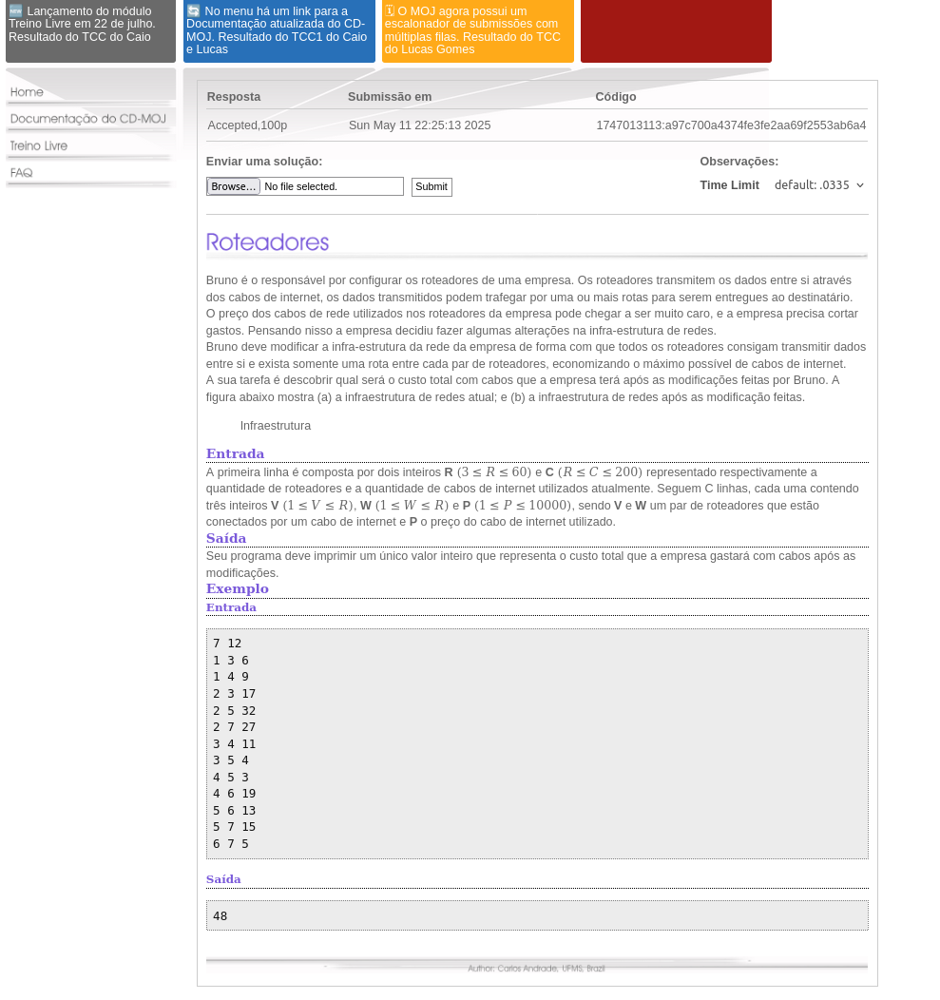
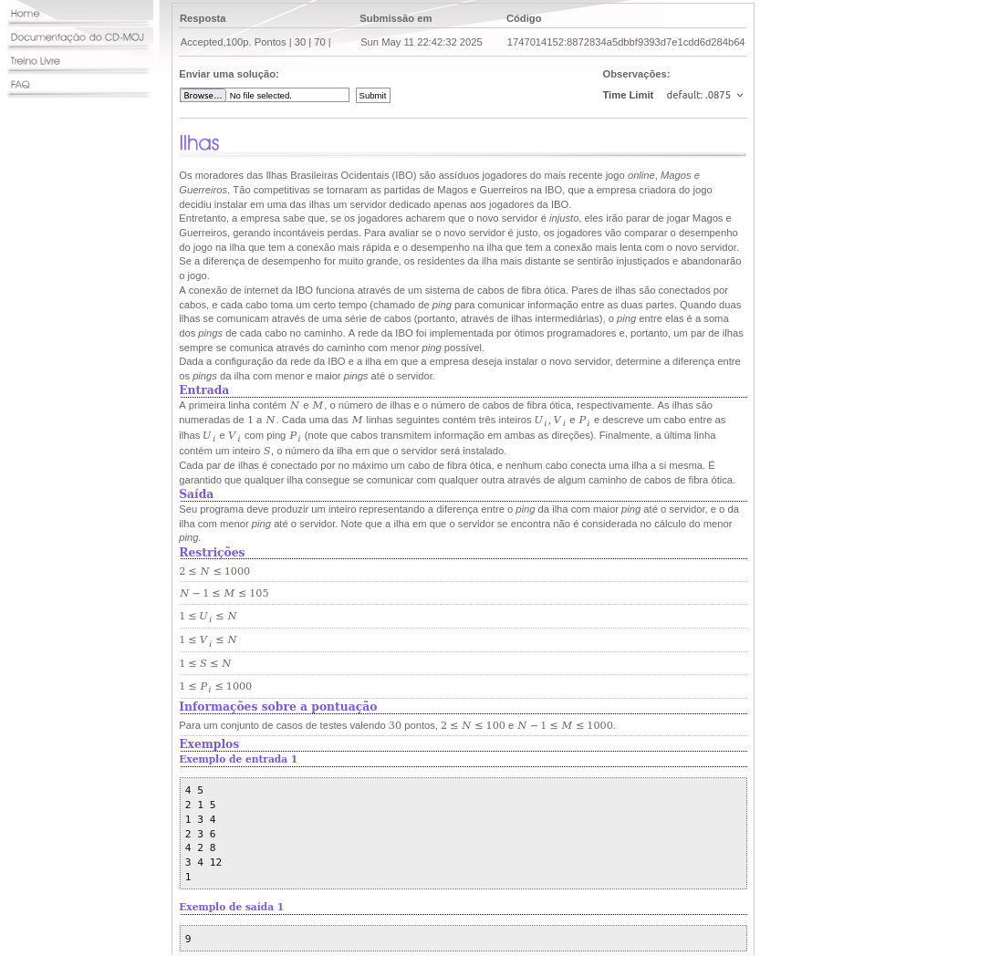

# Grafos2_Exercicios

**Número da Lista**: X 
**Conteúdo da Disciplina**: Grafos 2 

## Alunos
|Matrícula | Aluno |
| -- | -- |
| 222006712 | Fábio Gabriel da Silva Barbosa |
| 221022696 | Nathan Benigno Ponce de Abreu |

## Sobre 

### Questões Médias
| Título | Responsável | 
| -- | -- | 
| Roteadores | Fábio gabriel | 
| | Nathan Abreu | 

### Questões Difíceis
| Título | Responsável | 
| -- | -- | 
| Ilhas | Fábio Gabriel | 
| | Nathan Abreu | 

## Screenshots
### [Roteadores](https://moj.naquadah.com.br/cgi-bin/questao.sh/monitores%23bee-roteadores)

### [Ilhas](https://moj.naquadah.com.br/cgi-bin/questao.sh/obi-problems%23obi2018f1pu_ilhas)

## Link do vídeo

## Instalação 
**Linguagem**: C, Python  
